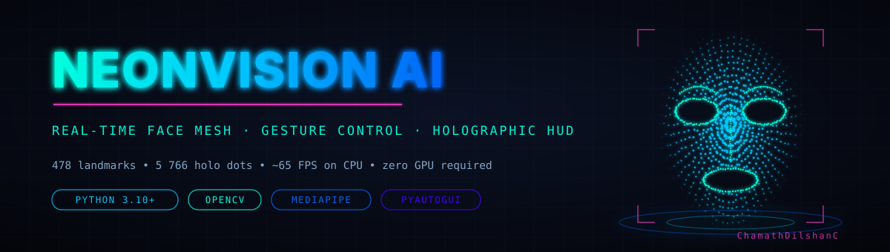
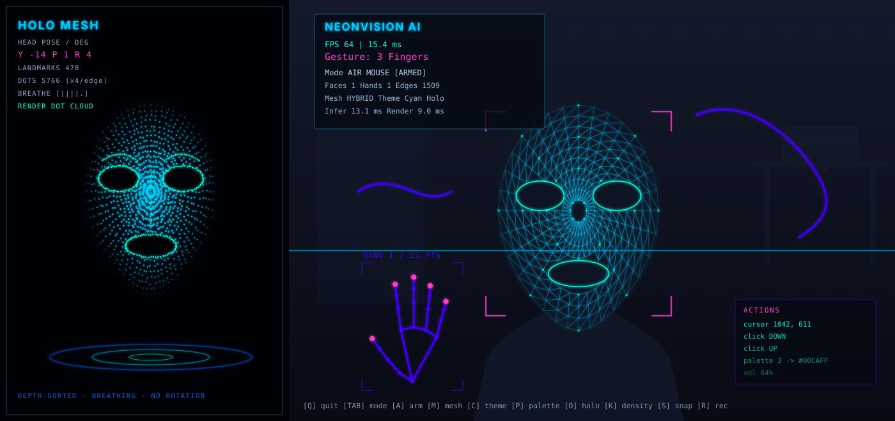
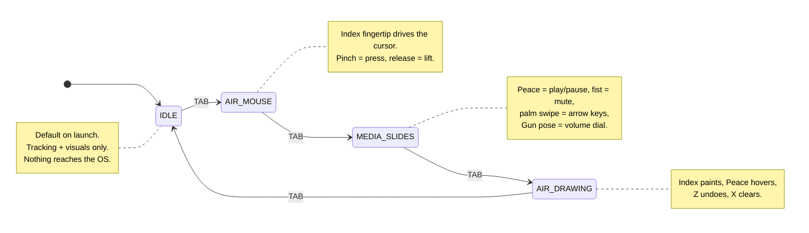
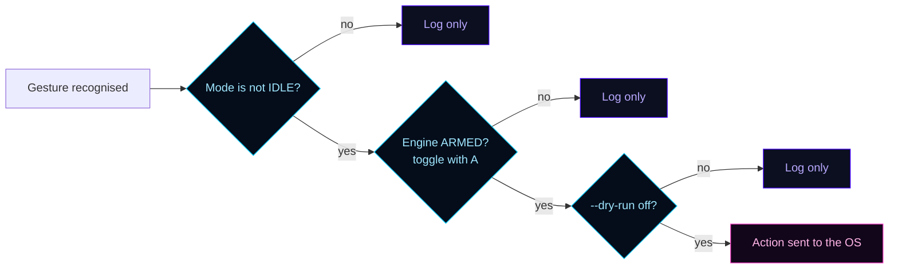
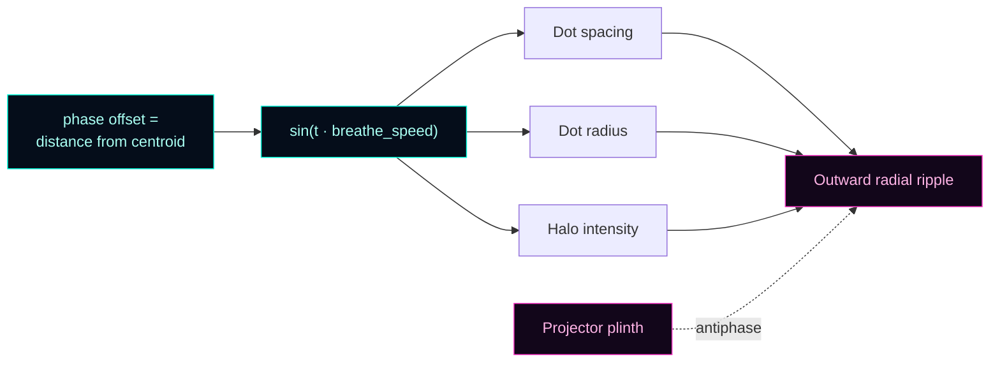
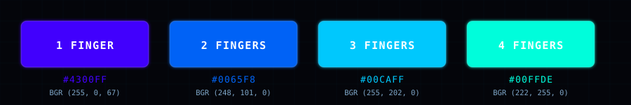
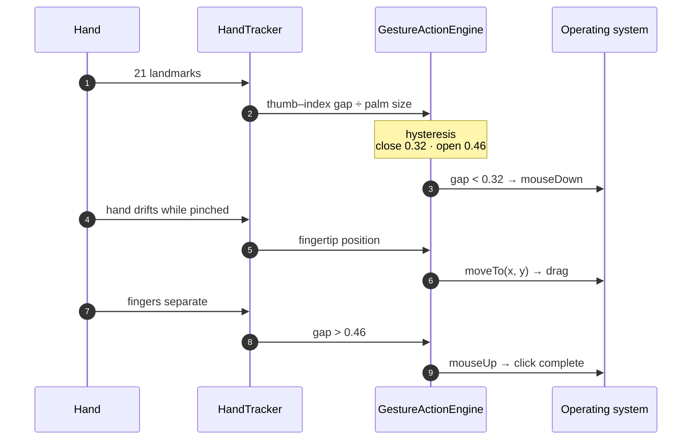
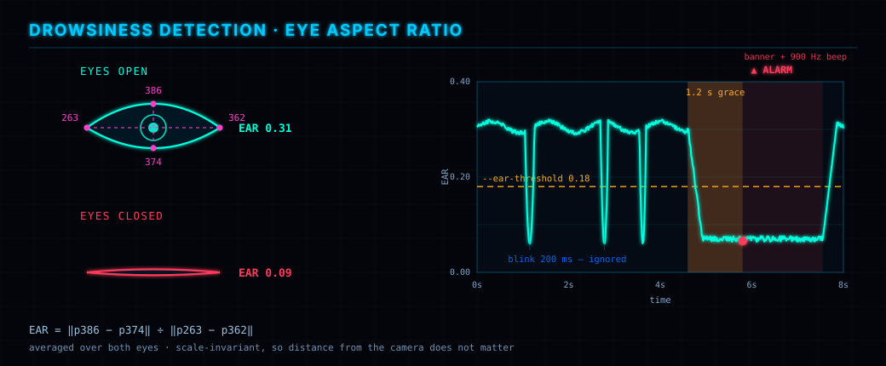
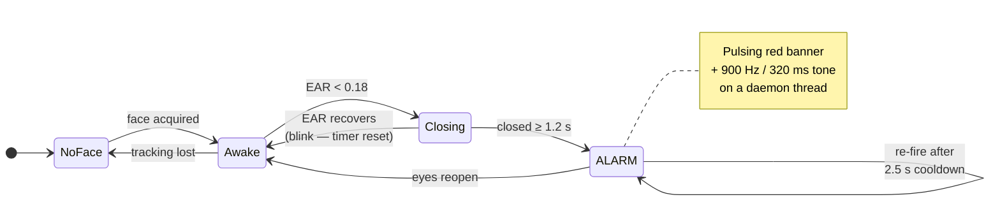
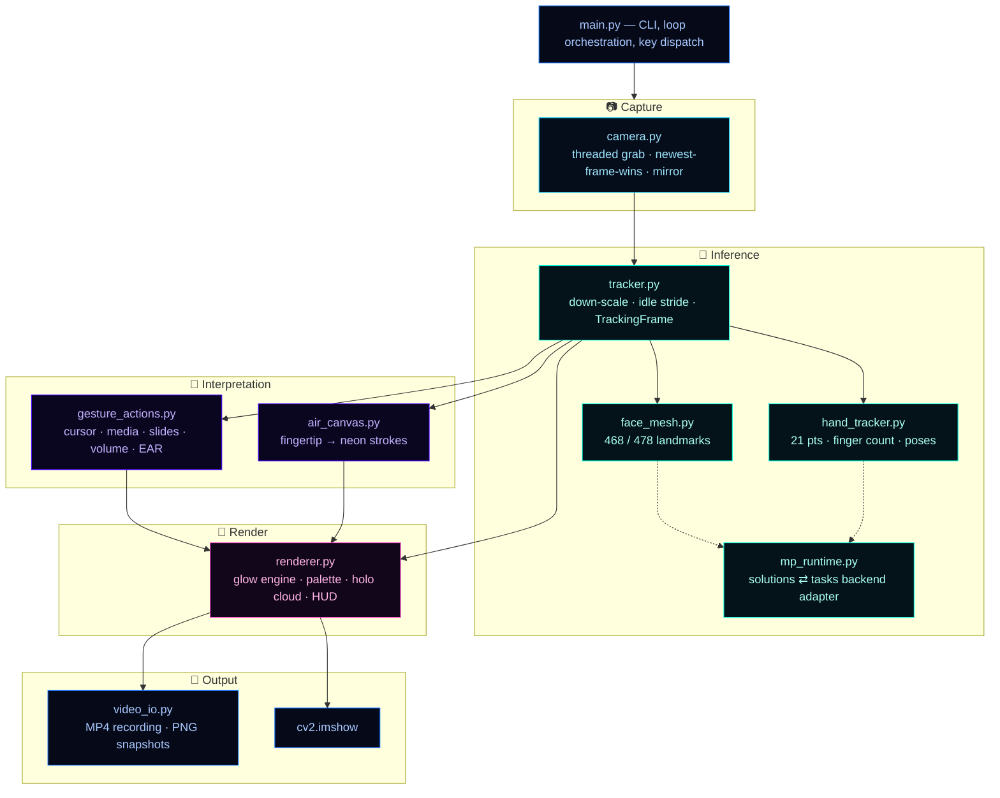

<div align="center">



<br>

**Real-time face mesh, hand-gesture recognition and gesture-driven computer control — wrapped in a futuristic neon / holographic interface.**

Runs at ~65 FPS on a plain CPU. No CUDA. No discrete GPU. Just a webcam.

<br>

[](https://www.python.org/)
[](https://opencv.org/)
[](https://ai.google.dev/edge/mediapipe)
[](https://numpy.org/)

[](#platform-support)
[](LICENSE)
[](https://github.com/psf/black)
[](#-performance)
[](https://github.com/ChamathDilshanC)

<br>

[**Features**](#-feature-overview) &nbsp;·&nbsp; [**Quick start**](#-quick-start) &nbsp;·&nbsp; [**Gesture control**](#-gesture-control) &nbsp;·&nbsp; [**Sleep detection**](#-sleep-detection--alarm-system) &nbsp;·&nbsp; [**Architecture**](#-architecture) &nbsp;·&nbsp; [**Performance**](#-performance) &nbsp;·&nbsp; [**Reference**](#-complete-reference) &nbsp;·&nbsp; [**Feature guide**](FEATURES.md)

</div>

---

## What is NeonVision AI?

NeonVision AI turns an ordinary webcam into a holographic control surface.

It reads **478 facial landmarks** and **21 landmarks per hand** every frame, paints them as a glowing neon wireframe, projects a **depth-sorted point cloud of ~5 800 dots** into a side panel that breathes like a real hologram, and — when you choose to arm it — lets your hand drive the **mouse, media keys, presentation slides, system volume and a neon air-drawing canvas**.

It also watches your eyes. If they stay closed too long, it raises a drowsiness alarm.

Everything runs locally on the CPU. Nothing leaves your machine.

<div align="center">

<sub><b>Left:</b> the standalone <code>HOLO MESH</code> dot cloud with live head-pose readout &nbsp;·&nbsp; <b>Right:</b> the camera feed with the neon wireframe, tracked hand skeleton, targeting brackets, HUD and action log</sub>
</div>

---

## ✨ Feature overview

| | Feature | What it gives you |
|---|---|---|
| 🧬 | **468 / 478-point face mesh** | Glowing neon wireframe in tesselation, contour or hybrid style |
| 💡 | **True glow rendering** | Multi-pass stamping + Gaussian blur + additive blend, not thin lines |
| 🖐️ | **Dual-hand tracking** | 21 landmarks per hand, finger counting and 13 named poses |
| 🔮 | **Holographic dot panel** | ~5 766 depth-sorted dots, breathing animation, no rotation |
| 🧭 | **Live head pose** | Yaw / pitch / roll in degrees, from an orthonormal facial basis |
| 🎨 | **Gesture colour palette** | Held-up finger count recolours the whole scene |
| 🖱️ | **Air mouse** | Fingertip moves the cursor; pinch to click and drag |
| 🎵 | **Media & slide control** | Play/pause, mute, arrow-key swipes, analogue volume dial |
| ✏️ | **Air drawing** | Paint neon strokes in mid-air with undo and clear |
| 😴 | **[Sleep detection & alarm](#-sleep-detection--alarm-system)** | Eye-Aspect-Ratio watchdog — pulsing banner + 900 Hz tone, blink-proof |
| 🎥 | **Video I/O** | MP4 recording, PNG snapshots, and offline video-file processing |
| 🛡️ | **Three safety layers** | Mode gate, arm/disarm toggle, and a full dry-run mode |

---

## 🚀 Quick start

### Requirements

| | Minimum |
|---|---|
| **Python** | 3.10 or newer (3.9 works; 3.13 supported via the Tasks backend) |
| **Camera** | Any webcam — 720p @ 30 FPS or better recommended |
| **Compute** | CPU only. No CUDA, no discrete GPU |
| **Disk** | ~12 MB for the MediaPipe model bundles (Tasks backend only) |

### Install

```bash
git clone https://github.com/ChamathDilshanC/NeonVision-AI.git
cd NeonVision-AI

python -m venv .venv
# Windows
.venv\Scripts\activate
# macOS / Linux
source .venv/bin/activate

pip install -r requirements.txt
```

> [!TIP]
> **VS Code users:** select `.venv` as your interpreter (`Ctrl+Shift+P` → *Python: Select Interpreter*), otherwise the editor reports the packages as missing even though they are installed.

### Run

```bash
python main.py                              # 720p, everything on
python main.py --dry-run                    # recommended first run — recognises, sends nothing
python main.py --camera 1                   # second webcam
python main.py --camera myclip.mp4          # process a recorded video file
python main.py --mode mouse                 # boot straight into air-mouse mode
python main.py --infer-scale 0.6 --no-holo  # maximum frame rate
```

A window opens with two halves: the **holographic dot panel** on the left, your **camera feed with the neon mesh** on the right.

<div align="center">

| Live at startup | What you should see |
|---|---|
| Face mesh + neon glow | Glowing wireframe locked onto your face |
| Holo dot panel | Breathing point cloud, left side |
| Hand tracking | `Gesture: 3 Fingers` in the HUD |
| Drowsiness watchdog | `Eyes OPEN (EAR 0.31)` in the HUD |

</div>

Control of your actual computer is **deliberately off** until you ask for it. See the next section.

---

## 🎛️ The mode system

The air mouse, media control and air drawing all want the same hand, so gesture control is **mode-based**. Press `TAB` to cycle.



### Three independent safety layers



PyAutoGUI's corner failsafe stays enabled on top of all three: shoving the pointer into a screen corner disarms the engine instantly.

---

## 🧬 Vision features

### Face mesh

- **468 landmarks**, or **478** with iris refinement on (the default).
- Three mesh styles cycled with `M`: **hybrid** → **tesselation** (1 322 edges) → **contours** → off.
- Every *n*-th landmark is stamped as a bright node (`--node-stride`, default 8).

### True glow, not thin lines

Every stroke is stamped several times at decreasing thickness into a **half-resolution buffer**, blurred once with a Gaussian kernel, upscaled and blended **additively**, then over-drawn with a crisp core filament. That layering is what makes the mesh read as emitted light instead of coloured line art.

### Hand tracking & finger counting

Up to two hands, reported as `Gesture: 3 Fingers`, plus 13 named poses.

**Rotation-invariant by design.** Fingers are classified by fingertip-versus-knuckle *distance from the wrist*, normalised by palm size — so counting keeps working when your hand is tilted, rotated or fully upside down. A rolling majority vote over N frames (`--gesture-smoothing`, default 5) kills single-frame flicker.

| Pose | Fingers up | Bound to |
|---|---|---|
| **Fist** | none | Mute *(MEDIA)* |
| **Open Palm** | all 5 | Slide swipe *(MEDIA)* |
| **Peace** | index + middle | Play/pause *(MEDIA)*, pen up *(DRAW)* |
| **Pointing** | index | Cursor *(MOUSE)*, pen down *(DRAW)* |
| **Gun** | thumb + index | Volume dial *(MEDIA)* |
| **Thumbs Up** | thumb | — |
| **Rock On** | index + pinky | — |
| **Call Me** | thumb + pinky | — |
| **OK** | middle + ring + pinky, thumb pinched to index | — |
| **Three Up / Four Up / Trio / Pinky Out** | see [FEATURES.md](FEATURES.md#9-complete-gesture-reference) | — |

---

## 🔮 Holographic UI

### The HOLO MESH dot cloud

A floating point cloud on black beside the camera feed. It is **dots only, by design** — no connecting lines are ever drawn there. The wireframe lives on the camera feed; the panel is its point-cloud counterpart.

| Property | Detail |
|---|---|
| **Density** | ~**5 766** dots, not 478 — extra points are interpolated along every mesh edge (1 322 edges × 4 + 478 landmarks by default) |
| **Spacing** | Dots land ~2.5 px apart on screen, so the cloud reads as a high-resolution Lidar scan |
| **Adaptive radius** | Dot radius shrinks as density rises, so neighbours never fuse back into a wireframe |
| **Real projection** | MediaPipe's per-landmark `z` is centred, scaled and given a perspective divide |
| **Depth banding** | Dots are sorted into depth bands and drawn far-to-near with rising radius and brightness |
| **Controls** | `K` cycles ×0 / ×2 / ×4 / ×6 · `--holo-density` sets it · `O` hides the panel |

That depth ramp is exactly what reads as a floating hologram rather than a flat stipple.

### Breathing, not rotating

The cloud never spins. A single sine wave drives three quantities together each frame:



Each dot's phase is offset by its distance from the centroid, so the pulse **travels outward as a slow radial ripple** instead of the whole cloud scaling in lockstep. That is what makes it look alive rather than mechanically zoomed. Tune with `--breathe-speed` and `--breathe-amount`; `L` freezes it at neutral size.

### Live head pose

Yaw, pitch and roll in degrees, derived from an orthonormal basis built out of the eye line and the forehead-to-chin axis — printed live in the panel header.

### Gesture-controlled colour palette

The held-up finger count recolours the main wireframe **and** the holographic dots with the project's brand colours.

<div align="center">

</div>

Any other count — none, or a full open palm — keeps the base theme, so the palette is something you **opt into** rather than a constant flicker. `P` toggles the whole behaviour; `C` cycles the base theme underneath it.

---

## 🖱️ Gesture control

| Mode | Gesture | Result |
|---|---|---|
| **any** | 1 / 2 / 3 / 4 fingers | Recolour both meshes |
| **AIR MOUSE** | Index fingertip position | Move the OS cursor |
| **AIR MOUSE** | Pinch thumb + index | Press / release the mouse button |
| **MEDIA** | Peace | Play / pause |
| **MEDIA** | Fist | Mute toggle |
| **MEDIA** | Gun pose, vary the gap | Set system volume |
| **MEDIA** | Open palm, sweep sideways | Left / right arrow key |
| **DRAW** | Index only | Pen down — paint |
| **DRAW** | Peace / palm / fist | Pen up |

### How a pinch becomes a click



The gap is **normalised by palm size**, so it behaves identically whether you are 30 cm or 2 m from the camera. The deliberate hysteresis band means a hand hovering near the threshold cannot chatter between click and release.

### Air mouse
The index fingertip drives the OS cursor. A quick pinch is a click, a held pinch is a drag.

### Media control
Peace (2 fingers) toggles play/pause; a fist mutes.

### Slide controller
An open-palm swipe left or right sends the arrow keys — built for presentations. Travel and time window are tunable (`SWIPE_DISTANCE`, `SWIPE_WINDOW`).

### Volume dial
The thumb-to-index span in the Gun pose maps to system volume, normalised by palm size. On Windows with `pycaw` installed this is **absolute** volume control; elsewhere it falls back to synthesised media keys. The HUD names the active backend: `system`, `keys` or `none`.

### Air drawing
The index fingertip paints neon strokes in the current palette colour. Index alone draws, Peace hovers, `Z` undoes the last stroke, `X` clears the canvas.

---

## 😴 Sleep detection & alarm system

NeonVision AI watches your eyes on **every single frame** and raises an alarm if they stay shut. It is on by default, costs almost nothing, and never needs a second camera or a wearable.

<div align="center">

</div>

### How it detects sleep

The detector is built on the **Eye Aspect Ratio (EAR)** — the ratio of an eye's vertical eyelid separation to its horizontal width. As the eyelid closes, the numerator collapses toward zero while the denominator stays put, so the ratio falls off a cliff.

Four landmarks per eye are read straight out of the face mesh:

| Eye | Top lid | Bottom lid | Outer corner | Inner corner |
|---|---|---|---|---|
| **Left** | `386` | `374` | `263` | `362` |
| **Right** | `159` | `145` | `133` | `33` |

```text
        ‖p_top − p_bottom‖
EAR  =  ──────────────────      averaged over both eyes
        ‖p_outer − p_inner‖
```

Because it is a **ratio of two distances on the same face**, EAR is scale-invariant: it reads the same whether you sit 30 cm or 2 m from the camera, and it does not care about image resolution. Implemented in [`core/face_mesh.py`](core/face_mesh.py) as `FaceMeshResult.eye_aspect_ratio()`.

| EAR | Meaning |
|---|---|
| **~0.31** | Eyes wide open |
| **~0.18** | Threshold — the default line between open and closed |
| **~0.09** | Eyes fully shut |

### Why blinking never sets it off

A natural blink lasts **100–300 ms**. The watchdog therefore does not fire the moment EAR dips — it requires the ratio to stay below threshold **continuously for 1.2 seconds** before it calls it sleep. Any recovery above the threshold resets the timer to zero.



### What happens when it fires

| | Behaviour |
|---|---|
| **Visual** | A full-width pulsing red **`DROWSINESS DETECTED`** banner across the frame — always shown, on every platform |
| **Audible** | A 900 Hz, 320 ms tone |
| **Non-blocking** | `winsound.Beep` blocks for the whole tone, which would stall the render loop — so tones are played on a short-lived **daemon thread** and suppressed while one is already sounding. The video never drops a frame for the alarm |
| **Alarm cooldown** | 2.5 s minimum gap between alarms, so a long closure pulses rather than screams continuously |
| **Never fatal** | The beep path swallows every exception by design — an alert must never crash the loop |
| **Reset** | Reopening your eyes clears the state immediately; losing the face resets the watchdog |

Implemented as `DrowsinessMonitor` and `Buzzer` in [`controls/gesture_actions.py`](controls/gesture_actions.py).

### Controls & tuning

| | |
|---|---|
| **On by default** | Yes — no flag needed |
| **Toggle live** | `D` |
| **Confirm it works** | The HUD shows `Eyes OPEN (EAR 0.31)`. Close your eyes for 2 seconds |

| Flag | Default | Effect |
|---|---|---|
| `--ear-threshold` | `0.18` | EAR below which the eyes count as closed — **higher = more sensitive** |
| `--drowsy-seconds` | `1.2` | Continuous closure needed before the alarm — **lower = quicker to fire** |
| `--no-alarm` | off | Silent mode: banner only, no tone |
| `--no-drowsiness` | off | Disable the watchdog entirely at startup |

**Sensible presets:**

```bash
python main.py --ear-threshold 0.22 --drowsy-seconds 0.8   # hair-trigger: driver monitoring
python main.py                                             # balanced default
python main.py --ear-threshold 0.15 --drowsy-seconds 2.0   # relaxed: squinters, small eyes
python main.py --no-alarm                                  # library / office friendly
```

> [!TIP]
> If the alarm fires while you are awake, your natural EAR is below average — **lower** `--ear-threshold` toward `0.15`. If a real doze slips past it, **raise** it toward `0.22`.

> [!NOTE]
> `winsound` is Windows-only; on macOS and Linux the tone falls back to the terminal bell. **The banner always shows, everywhere.**

### Where it earns its keep

- **Driver / rider monitoring** on a laptop or dash-mounted device
- **Long study or work sessions** — catches the moment focus goes
- **Night-shift and control-room stations** where staying awake is the job
- **Sleep-onset research and self-tracking**, using the printed session summary

---

## 📊 Live monitoring

The HUD reports rolling FPS, total frame time and **per-stage timings** — inference vs render — so you can see exactly where a slow frame went, plus the live EAR readout, tracking counts, active mode and arm state. A session summary is printed on exit.

---

## 🎥 Video I/O

| Feature | How |
|---|---|
| **Process a recorded video** | `python main.py --camera myclip.mp4` |
| **MP4 recording** | `R` toggles — records the exact composed view |
| **PNG snapshot** | `S` |
| **Output location** | Everything lands in `output/` |

---

## 🏗️ Architecture



### Frame pipeline

```text
Camera.read()                    mirror + newest-frame-wins
    │
    ├─ VisionTracker.process     down-scale, face mesh, hands, idle stride
    │
    ├─ gesture palette           finger count -> brand colour
    │
    ├─ GestureActionEngine       cursor / media / slides / volume
    ├─ AirCanvas                 fingertip -> neon strokes
    ├─ DrowsinessMonitor         EAR -> banner + beep
    │
    ├─ NeonRenderer              queue geometry -> one glow pass -> cores
    ├─ HUD / brackets / badges / action log
    ├─ HoloPreview.compose       3D head-pose panel + camera feed
    │
    └─ cv2.imshow  +  VideoRecorder
```

### Project layout

```text
NeonVision-AI/
├── main.py                 # CLI, loop orchestration, key dispatch
├── core/
│   ├── camera.py           # Capture, threaded grabbing, lifecycle
│   ├── tracker.py          # Unified face + hand front-end, scheduling
│   ├── face_mesh.py        # Face mesh inference -> pixel landmark arrays
│   ├── hand_tracker.py     # Hand inference + finger counting / gestures
│   └── mp_runtime.py       # MediaPipe backend abstraction + model cache
├── controls/
│   ├── gesture_actions.py  # Cursor, clicks, media, slides, volume, EAR
│   └── air_canvas.py       # Neon paint stroke capture
├── utils/
│   ├── renderer.py         # Glow engine, palette, holo dot cloud, HUD
│   ├── video_io.py         # Source resolution, MP4 recording, snapshots
│   └── fps_counter.py      # Rolling FPS + per-stage profiling
├── docs/                   # README artwork
├── models/                 # Tasks model bundles (auto-downloaded)
├── output/                 # Snapshots and recordings
├── FEATURES.md             # Full feature guide
├── Architecture.md         # System architecture notes
└── requirements.txt
```

### The MediaPipe backend split

MediaPipe ships two generations of Python API, and which one your wheel has depends on your Python version. `core/mp_runtime.py` detects this at import and adapts, so nothing else in the codebase changes.

| Python | MediaPipe wheel | API used | Model files |
|---|---|---|---|
| 3.9 – 3.12 | `mediapipe` 0.10.x | `mediapipe.solutions` | bundled |
| 3.13+ | `mediapipe` 0.10.30+ | `mediapipe.tasks` | downloaded once |

On the Tasks backend the two model bundles (`face_landmarker.task` ~3.8 MB, `hand_landmarker.task` ~7.5 MB) are fetched from Google's public model host on first run and cached in `models/`. To run **fully offline**, download them yourself into `models/`:

- [`face_landmarker.task`](https://storage.googleapis.com/mediapipe-models/face_landmarker/face_landmarker/float16/1/face_landmarker.task)
- [`hand_landmarker.task`](https://storage.googleapis.com/mediapipe-models/hand_landmarker/hand_landmarker/float16/1/hand_landmarker.task)

Set `NEONVISION_MODEL_DIR` to cache them elsewhere.

---

## ⚡ Performance

Measured at 1280×720 on an Intel CPU, Python 3.13, MediaPipe Tasks backend, **no discrete GPU**:

| Configuration | Frame time | FPS | |
|---|---:|---:|---|
| Defaults, empty scene | 15.4 ms | **65** | `████████████████████` |
| `--no-holo` (with subject) | ~21 ms | **48** | `███████████████` |
| 1920×1080, empty scene | 20.0 ms | **50** | `███████████████` |
| `--holo-density 2` (with subject) | ~26 ms | **39** | `████████████` |
| Defaults, face + hand tracked | ~26 ms | **38** | `███████████` |

Render-only cost with a face and hand on screen is **~14 ms**, of which the holographic dot panel is ~7 ms; the rest of the budget is MediaPipe inference (~13 ms). Gesture control and the drowsiness watchdog together cost **under 0.1 ms** per frame — they are pure geometry on 21 landmarks.

### Why it stays fast

<table>
<tr><td><b>1 · One blur per frame</b></td><td>Geometry from every face, hand and paint stroke is queued before anything is composited, so the Gaussian pass runs <i>once</i> no matter how much is on screen.</td></tr>
<tr><td><b>2 · Glow at half resolution</b></td><td>Blurred small, then upscaled — blur cost scales with pixels.</td></tr>
<tr><td><b>3 · Dirty-region compositing</b></td><td>The renderer tracks the bounding box it actually drew into and restricts blur, upscale and blend to it. This alone cut render time from <b>12.5 ms → 9 ms</b> at 720p.</td></tr>
<tr><td><b>4 · Batched polylines</b></td><td>Mesh topology is pre-flattened into <code>(N, 2)</code> index arrays at import, so all 1 322 tesselation edges are drawn by a single <code>cv2.polylines</code> call on a NumPy slice — never a Python loop.</td></tr>
<tr><td><b>5 · Idle-frame sampling</b></td><td>MediaPipe re-runs the full palm detector every frame while nothing is tracked (~20 ms), then switches to a much cheaper landmark path once a hand is locked on. <code>--hand-idle-stride</code> amortises the idle case; latency while a hand is present is unaffected.</td></tr>
<tr><td><b>6 · Vectorised dot scatter</b></td><td>Each of the 5 766 dots is stamped with NumPy fancy indexing and the batch is clipped <i>once</i>. The same cloud through a per-point <code>cv2.circle</code> loop measures <b>17.7 ms</b>; the scatter path measures <b>0.08 ms</b> — a <b>200×</b> difference, and the only reason this density is affordable at all.</td></tr>
</table>

---

## 📖 Complete reference

### Keyboard

| Key | Action | | Key | Action |
|---|---|---|---|---|
| `Q` / `Esc` | Quit | | `O` | Show / hide the holographic panel |
| `TAB` | Cycle interaction mode | | `L` | Toggle the breathing animation |
| `A` | Arm / disarm OS actions | | `K` | Holo density: ×0 → ×2 → ×4 → ×6 |
| `M` | Mesh style: hybrid → tess → contours → off | | `D` | Toggle the drowsiness watchdog |
| `C` | Cycle base colour theme | | `X` / `Z` | Clear canvas / undo stroke |
| `P` | Toggle the gesture colour palette | | `B` | Toggle the HUD |
| `V` / `H` | Toggle face mesh / hand tracking | | `S` | Snapshot → `output/` |
| `G` | Toggle the neon glow | | `R` | Start / stop MP4 recording |
| | | | `F` | Fullscreen |

Keys are case-insensitive and the window must have focus.

### Command line

<details>
<summary><b>Capture</b></summary>

| Flag | Default | Effect |
|---|---|---|
| `--camera` | `0` | Device index, or a path to a video file |
| `--width` | `1280` | Capture width |
| `--height` | `720` | Capture height |
| `--fps` | `30` | Requested capture frame rate |
| `--no-flip` | off | Disable the mirrored preview |
| `--no-thread` | off | Read frames synchronously |

</details>

<details>
<summary><b>Tracking</b></summary>

| Flag | Default | Effect |
|---|---|---|
| `--max-faces` | `1` | Maximum faces to track |
| `--max-hands` | `2` | Maximum hands to track |
| `--no-refine` | off | Skip iris refinement (468 instead of 478) |
| `--hand-complexity` | `1` | `0` is faster, `1` more accurate ¹ |
| `--face-confidence` | `0.5` | Face detection / tracking threshold |
| `--hand-confidence` | `0.6` | Hand detection / tracking threshold |
| `--gesture-smoothing` | `5` | Frames in the pose majority vote |
| `--hand-idle-stride` | `2` | Sample hand inference every N frames while idle |
| `--infer-scale` | `1.0` | Run inference on a down-scaled copy (0.25–1.0) |

¹ `--hand-complexity` only applies on the older MediaPipe `solutions` backend; the `tasks` backend has no complexity dial. The startup banner names your backend.

</details>

<details>
<summary><b>Controls</b></summary>

| Flag | Default | Effect |
|---|---|---|
| `--mode` | `idle` | Initial mode: `idle`, `mouse`, `media`, `draw` |
| `--dry-run` | off | Recognise gestures, send nothing to the OS |
| `--no-actions` | off | Start disarmed |
| `--ear-threshold` | `0.18` | EAR below which the eyes count as closed |
| `--drowsy-seconds` | `1.2` | Eye closure before the alarm |
| `--no-drowsiness` | off | Disable the eye watchdog |
| `--no-alarm` | off | Silent alarm (banner only) |

</details>

<details>
<summary><b>Appearance</b></summary>

| Flag | Default | Effect |
|---|---|---|
| `--mesh-style` | `hybrid` | `hybrid`, `tesselation`, `contours`, `off` |
| `--node-stride` | `8` | Draw every n-th landmark as a node; `0` disables |
| `--no-glow` | off | Disable the blurred glow pass |
| `--no-palette` | off | Do not recolour from the finger count |
| `--no-holo` | off | Hide the holographic panel (~6 ms/frame cheaper) |
| `--holo-width` | `0.34` | Panel width as a fraction of the frame (0.15–0.6) |
| `--holo-density` | `4` | Points interpolated per mesh edge (0–12) |
| `--breathe-speed` | `1.9` | Breathing rate, radians/second |
| `--breathe-amount` | `0.07` | Peak dot-spacing swing; `0` freezes it |

</details>

<details>
<summary><b>Environment variables</b></summary>

| Variable | Effect |
|---|---|
| `NEONVISION_MODEL_DIR` | Where MediaPipe `.task` bundles are cached |

</details>

### Tuning constants

Edit these in the source if the defaults do not suit you:

| Constant | File | Default | Controls |
|---|---|---|---|
| `PINCH_CLOSE` | `controls/gesture_actions.py` | `0.32` | Click press point |
| `PINCH_OPEN` | `controls/gesture_actions.py` | `0.46` | Click release point |
| `VOLUME_MIN_RATIO` | `controls/gesture_actions.py` | `0.22` | Gap = 0 % volume |
| `VOLUME_MAX_RATIO` | `controls/gesture_actions.py` | `1.05` | Gap = 100 % volume |
| `SWIPE_DISTANCE` | `controls/gesture_actions.py` | `0.17` | Swipe travel needed |
| `SWIPE_WINDOW` | `controls/gesture_actions.py` | `0.45` | Swipe time window (s) |
| `FINGER_RATIO` | `core/hand_tracker.py` | `1.12` | Finger-extended threshold |
| `THUMB_RATIO` | `core/hand_tracker.py` | `1.10` | Thumb-extended threshold |
| `OK_PINCH_RATIO` | `core/hand_tracker.py` | `0.42` | OK-sign pinch tightness |

---

## 🖥️ Platform support

| Platform | Vision | Air mouse & keys | Absolute volume | Alarm beep |
|---|:---:|:---:|:---:|:---:|
| **Windows 10 / 11** | ✅ | ✅ | ✅ `pycaw` | ✅ `winsound` |
| **macOS** (Intel & Apple Silicon) | ✅ | ✅ | ⚠️ media keys | ⚠️ terminal bell |
| **Linux** (Ubuntu 20.04+) | ✅ | ✅ | ⚠️ media keys | ⚠️ terminal bell |

---

## 🛠️ Troubleshooting

<details>
<summary><b>"Unable to open capture source 0"</b></summary>

The camera is in use by another app, or blocked. On Windows check *Settings → Privacy & security → Camera*. Try `--camera 1` for an external webcam.
</details>

<details>
<summary><b>The cursor moves when I don't want it to</b></summary>

Press `A` to disarm, or `TAB` back to `IDLE`. Start with `--dry-run` while you get used to the gestures. Shoving the pointer into a screen corner also triggers PyAutoGUI's failsafe.
</details>

<details>
<summary><b>Volume does nothing</b></summary>

The HUD shows the active backend. `system` means absolute control via pycaw (Windows). `keys` means synthesised media keys, which some applications capture instead of the OS. `none` means neither is available.
</details>

<details>
<summary><b>No beep on the drowsiness alarm</b></summary>

`winsound` is Windows-only; elsewhere the alarm falls back to the terminal bell. The banner always shows.
</details>

<details>
<summary><b>Low frame rate</b></summary>

In order of impact: `--holo-density 2`, `--no-holo`, `--infer-scale 0.6`, `--no-glow`, `--no-refine`.
</details>

<details>
<summary><b>Pinch clicks trigger too easily / not enough</b></summary>

The thresholds are `PINCH_CLOSE` and `PINCH_OPEN` on `GestureActionEngine`, expressed as a fraction of palm size. They have deliberate hysteresis, so a hand hovering near the boundary cannot chatter between click and release.
</details>

<details>
<summary><b>The preview window seems mirrored</b></summary>

Intentional, for a natural selfie view. Use `--no-flip` to disable it.
</details>

<details>
<summary><b>VS Code says the packages are missing</b></summary>

Select `.venv` as the interpreter: `Ctrl+Shift+P` → *Python: Select Interpreter* → `.venv`.
</details>

---

## 🧑‍💻 Development

```bash
pip install black flake8

black main.py core controls utils    # 88-column formatting
flake8                               # configured in .flake8
```

The codebase is plain, dependency-light Python: no framework, no build step, no code generation. Every module is independently importable and testable.

---

## 📚 Documentation

| Document | What is in it |
|---|---|
| [**FEATURES.md**](FEATURES.md) | Every feature, how to turn it on, and how to confirm it works |
| [**Architecture.md**](Architecture.md) | Module responsibilities and data flow |
| [**Technology Stack.md**](Technology%20Stack.md) | Every library, and why it was chosen |
| [**GitHub Push Guide.md**](GitHub%20Push%20Guide.md) | Repository and authorship workflow |

---

## 📄 License

Released under the [MIT License](LICENSE).

<div align="center">
<br>

**Designed, built and maintained by [ChamathDilshanC](https://github.com/ChamathDilshanC)**

<sub>Sole author, creator and owner of NeonVision AI.</sub>

<br>

<sub>If this project is useful to you, a ⭐ on the repository is genuinely appreciated.</sub>

</div>
